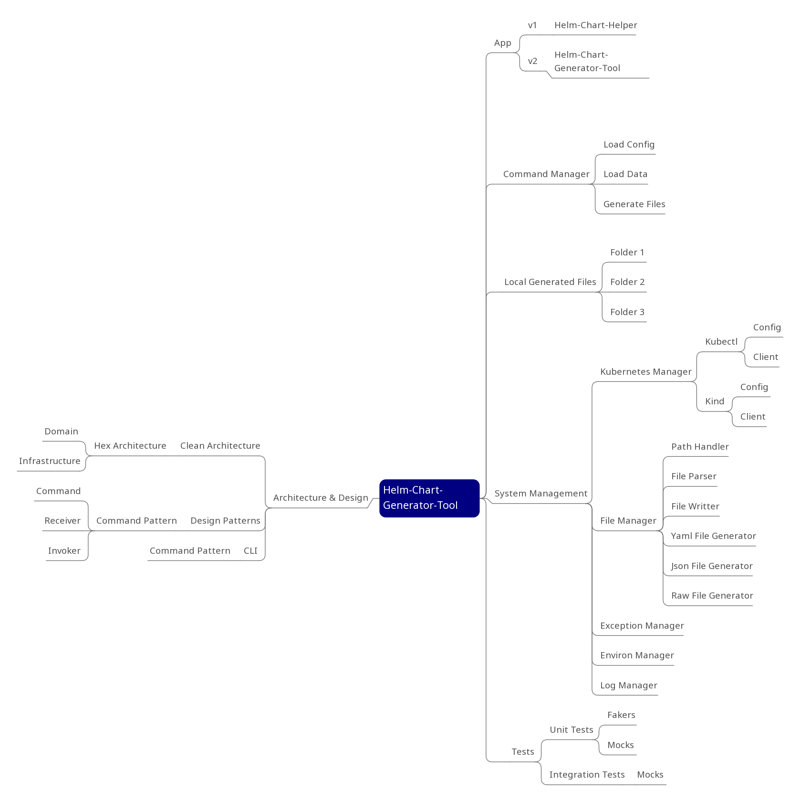

# helm-chart-generator-tool (v2.0)
This tool has been refactored based on the current script helm-chart-helper

## Purpose
The purpose behind this repository its about to improve the following:
- Readability
- Maintainability
- Testability

The ultimate goal it's to be able to create a framework for a long term app
usability

## Refactoring
In order to reach the mentioned above its necessary to generate a modular framework,
this means refactoring its required to transform our code in a modular way using TDD
as the main methodology.

That means we are going to create the testing in first place then we are going to 
refactor until the code meets the test specification.

## Architecture
According to best practices and keep design principles as clean as possible, we
are going to implement in this project from clean architectures a hexagonal architecture
based mainly in 2 things:
- Ports
- Adapters

This way it's going to help us as following:
- decoupling infrastructure
- increasing cohesion

And the final result is to be able to create a modular software structure as 
the foundation of the future framework.

## Project Schema
The following schema its intended to explain how its going to be the future solution



## Git-Flow
In the same way, the version control and the development flow it's going to be
improved introducing Git-Flow as following:
- Main
- Dev
- feat/branch-name
- fix/branch-name

We are going to introduce as well tools to ensure written commits and code formatting
keeps best practices using for example:
- pre-commits

## Testings
In this version testings are going to be introduced as well, working with
TDD concepts and practices, the first target we are looking for is to improve it's 
to generate testable units of code, that's means we are going to break down the
current solution into modules following the proposed architecture.

To do that we are going to be relying on the next tests tools: 
- Pytest
- Unittests

The motivation of doing testings it's to be able to isolate the logic from
the infrastructure and be able to test the logic in a consistent way, that help 
us to:
- detect changes that can break our code/functionality
- ensure our code its modular enough in order to be testable
- document the functionality of our solution

## helm-chart-helper (v1.0)
Script for creating helm charts form an existing deployment
- Original version

### Example
- Create configuration file
- Execute the following command:
```
python helm-chart-helper.py --name test
```
